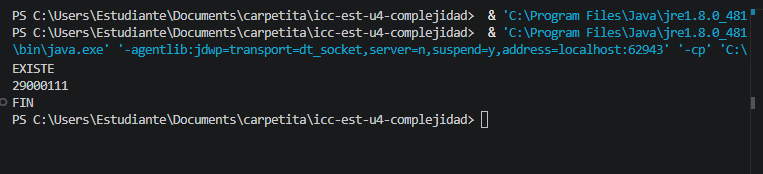

# Práctica: 04.01 Complejidad Proyecto JAVA

## Datos del Estudiante
- **Nombre:** Sofia Pacheco
- **Curso:** Estructura de Datos G2
- **Fecha:** 14/03/2026

---

## 1. icc-est-u4-complejidad

**Fecha:** 14/03/2026

**Descripción:** Creamos un proyecto y subimos a github

---

## 2. icc-est-u4-complejidad

**Fecha:** 15/03/2026

**Descripción:** Creamos la clase Estudiante y Generador y creamos un listado de estudiantes para buscar y optimizar la busqueda.

---

## 3. icc-est-u4-complejidad

**Fecha:** 15/03/26
**Descripción:** Ejemplos de bucles listados

---

Practica 04.01 fecha 15/04

